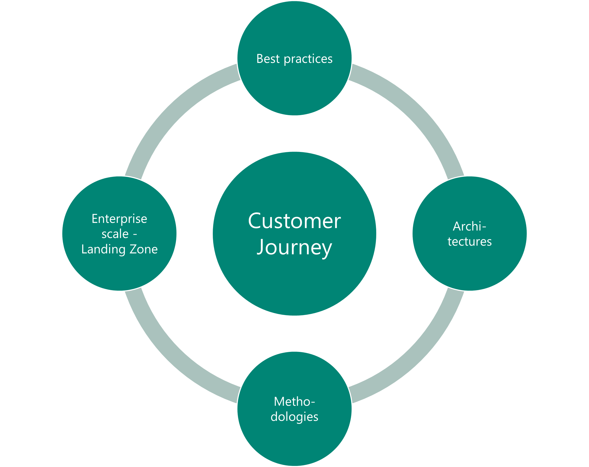

# Welcome to CAF Expert learning path

The Microsoft Cloud Adoption (CAF) Framework is an iterative approach to support the digital transformation journey of an organization. It gives a collection of best practices, architectures and methodologies to ensure the integration of cloud into this journey .

Having CAF Experts in your organization enables you as a partner to become a trusted advisor for your customers on their journey to cloud. Continuously generate more business with your customers along the iterative journey of the digital transformation!

> **_Further information please_** [download the PowerPoint](./sources/CAF%20Expert.pdf)

## CAF Introduction

There are multiple sources to get a quick introduction into the Cloud Adoption Framework. There is a CAF learning path in the [Microsoft Docs](https://docs.microsoft.com/learn/modules/microsoft-cloud-adoption-framework-for-azure/). This path is also the required pre-learning for the first module.

In addition there is [on-demand self learning path in german](https://caf-expert.github.io/caf-intro/) with a lot of videos and links towards tools and other supporting material.

## The learning path

The learning path is based on three main modules with multiple add-on modules.

- [Module 1: Cloud Adoption Framework - Basic](./caf-expert-basic.md)
- [Module 2: Cloud Adoption Framework - Migration](./caf-expert-migrate.md)
- [Moudle 3: Cloud Adoption Framework - Advanced](./caf-expert-advanced.md)

__Additional Modules:__

- Enterprise Scale – Infrastructure as Code College
- Enterprise Scale - Construction Sets
- and more to come...

## Module 1: Cloud Adoption Framework - Basic

### Online pre-Learning Module 1

[Online self paced learning](https://docs.microsoft.com/learn/modules/microsoft-cloud-adoption-framework-for-azure/)

### Hackathon Module 1

This CAF Hackathon enables attendees to understand and get familiar on how the Microsoft Cloud Adoption Framework for Azure (CAF) can be applied with their customers. This hackathon walks through the Define Strategy and Plan phases of the CAF to support attendees in leading a client engagement that is considering moving their digital assets to Azure.

By the end of the CAF Hackathon, attendees will have built a cloud adoption plan that they can use to present to a customer’s C-Suite to justify adopting the cloud. The purpose of this exercise is to provide you with the tools and understanding that will complement the conversations attendees may be having with their customers.

### Agenda Module 1

#### Day 1 (5h) Module 1

- Introduction
- Challenge 1 – 3
  Strategy, Govern, Plan

#### Day 2 (3h) Module 1

- Challenge Prepare presentation
- Presentation

[Learn more...](./caf-expert-basic.md)

## Module 2: Cloud Adoption Framework - Migration

### Pre-Learning Module 2

[Online self paced learning](https://docs.microsoft.com/learn/modules/app-and-infra-migration-and-modernization/)

### Hackathon Module 2

In this workshop, you will learn how to design a migration strategy for on-premises environments to Azure, including the migration of virtual and physical services as well as databases.

At the end of this workshop, you will be better able to rationalize the migration of various workloads to Microsoft Azure as well as understanding how to determine the cost of hosting migrated workloads in Azure.

### Agenda Module 2

#### Day 1 (6h) Module 2

- CAF Migrate
  Methodology, Tools
- Whiteboard Design Session

#### Day 2 (6h) Module 2

- HOL
Discovery and Assessment
- Migrate Application Database
- Migrate Application

[Learn more...](./caf-expert-migrate.md)

## Module 3: Cloud Adoption Framework - Advanced

### Pre-Learning Module 3

[Part 1 - Online training Governance Methodology](https://docs.microsoft.com/learn/modules/build-cloud-governance-strategy-azure/)

[Part 2 - Online training Enterprise Scale](https://docs.microsoft.com/learn/paths/enterprise-scale-architecture/)

### Hackathon Module 3

In this workshop, you will learn how to design an enterprise scale Landing Zone in Azure. You get familiar with the design principles and the critical design areas.

At the end of this workshop, you will be able to leverage the existing enterprise scale architectures, able to build your own as well as understanding how to establish a policy driven governance.

### Agenda Module 3

#### Day 1 (6h) Module 3

- Enterprise Scale Intro
  design principals
  Critical design areas

#### Day 2 (6h) Module 3

- Enterprise Scale
  first deployment
- HOL
  individual deployment

[Learn more...](./caf-expert-advanced.md)